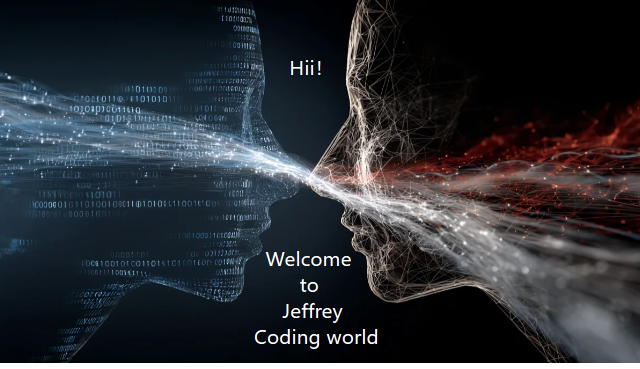

  

#### A Devout Lifelong Learning AI Developer
---

---
## Current Projects
- Decypher AI - AI-powered opportunity discovery and decision intelligence platform
- SynTour - AI-driven travel planning platform with LangGraph workflows
- FridgeLedger - AI receipt scanner and food waste tracking system
- Smart Campus AI - AI Digital Human and Smart Navigation System
---

## Tech Stack

---
## Connect With Me
- Email - [g0184036940@gmail.com](mailto:g0184036940@gmail.com)
- LinkedIn - https://www.linkedin.com/in/jeffrey-g962464
- YouTube - https://www.youtube.com/@Jeffrey-G96246
---

  

---